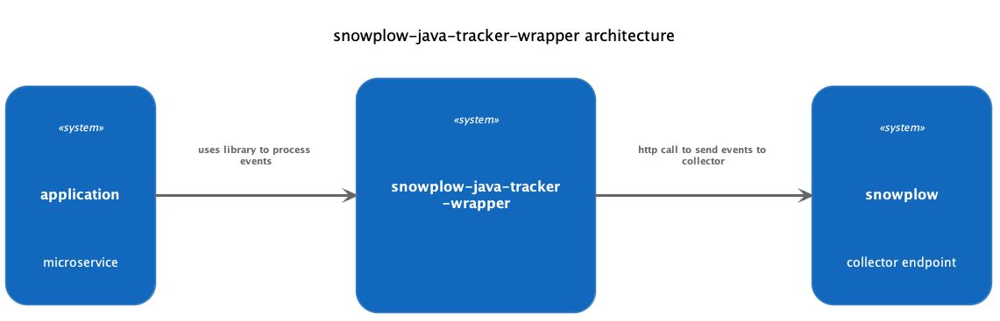

# snowplow-java-tracker-wrapper
[](https://github.com/upday/snowplow-java-tracker-wrapper/blob/b725e4a8a77ed7d5619c782b66affdec3dea05af/LICENSE)


###
Install

[](https://jitpack.io/#upday/snowplow-java-tracker-wrapper)

### Main Technologies

- Kotlin
- Snowplow

### Architecture



### Use-Case

You have to send events from a Java/kotlin Application to Snowplow. Maybe you have to do this from several services.
In order to not implement and configure the [Snowplow Java Tracker](https://github.com/snowplow/snowplow/wiki/Java-Tracker) several times you can use this wrapper instead.
This also provides retry mechanism for failed snowplow events. By default it retries for 5 times before calling the failure callback. 

### How to use

The following code showcases the usage or the wrapper in your service.
1. usage of the dispatcher.
2. example mapper with subject

```kotlin
@Component
class SnowplowEventDispatcher(private val snowplowMapper: SnowplowMapper) {
    
    private val dispatcher: SnowplowDispatcher = snowplowDispatcher(
        appId = "my-app-id",
        nameSpace = "app-namespace",
        collectorUrl = "http://localhost:1080",
        onFailure = { successCount, failedEvents -> /* onFailure code logic */} // this is optional
    )

    fun send(myEvent: MyEvent) = dispatcher.send(myEvent.toSnowplowEvent())

    private fun MyEvent.toSnowplowEvent(): Event? = snowplowMapper.map(this)

    companion object {
        private val logger = KotlinLogging.logger {}
    }
}

/**
 *  Snowplow mapper example to include the usedId on subject
 */
class SnowplowMapper(private val snowplowSchemaProvider: SnowplowSchemaProvider) {

    fun map(myEvent: MyEvent): Event? = mapToUnstructured(buildContext(myEvent), myEvent)

    private fun mapToUnstructured(context: List<SelfDescribingJson>, myEvent: MyEvent): Event? = 
        try {
            Unstructured.builder()
                .customContext(context)
                .eventData(createEventData(myEvent))
                .subject(Subject.SubjectBuilder().userId(myEvent.userId).build())
                .build()
        } catch (e: Exception) {
            logger.error("Error parsing event ${e.localizedMessage}: $myEvent")
            null
        }

    private fun createEventData(myEvent: MyEvent): SelfDescribingJson =
        SelfDescribingJson(
            snowplowSchemaProvider.getEventSchema(eventName = event.schemaName()),
            myEvent.attributeToMap()
        )

    private fun buildContext(myEvent: MyEvent) =
        listOf(SelfDescribingJson(
            snowplowSchemaProvider.getEnvironmentContextSchema(),
            mapOf("my_app_context_name" to myEvent.attributes.appName)
        ))
}
```

### _snowplowDispatcher_ doc
```kotlin
/**
 * @param appId snowplow application ID
 * @param nameSpace snowplow tracker name
 * @param collectorUrl snowplow URL
 * @param bufferSize Specifies how many events go into a POST, default 1
 * @param threadCount The number of Threads that can be used to send events, default 50
 * @param base64 enable base 64 encoding, default true
 * @param onSuccess [(successCount: Int) -> Unit] called to each success request, default null
 * @param onFailure [(successCount: Int, failedEvents: List<Event>) -> Unit] called to each failed request, default null
 */
fun snowplowDispatcher(
    appId: String,
    nameSpace: String,
    collectorUrl: String,
    bufferSize: Int = 1,
    threadCount: Int = 50,
    base64: Boolean = true,
    onSuccess: SuccessCallback? = null,
    onFailure: FailureCallback? = null
): SnowplowDispatcher
```

## Contributors

Any contribution is appreciated. See the contributors list in: https://github.com/upday/snowplow-java-tracker-wrapper/graphs/contributors

### Contributing 

Pull requests are welcome.
[Show your ❤ with a ★](https://github.com/upday/snowplow-java-tracker-wrapper/stargazers)


### TODO

